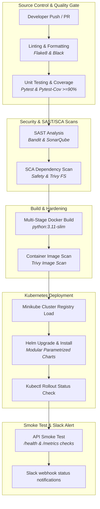

# 🛡️ Enterprise DevSecOps CI/CD Pipeline

[](https://github.com/humeshdeshmukh/enterprise-devsecops-pipeline)
[](https://www.python.org/)
[](https://flask.palletsprojects.com/)
[](https://kubernetes.io/)
[](https://helm.sh/)
[](https://github.com/aquasecurity/trivy)

[](https://github.com/humeshdeshmukh/enterprise-devsecops-pipeline/actions/workflows/ci-cd.yml)

A production-grade, portfolio-ready **DevSecOps CI/CD Pipeline** built to automate the development, testing, security auditing, containerization, and deployment of a Python-based Flask Product Catalog microservice onto a local Kubernetes (Minikube) cluster.

This repository demonstrates modern software engineering and operations best practices, showcasing robust **Shift-Left security scanning** (SAST, SCA, container vulnerability scanning), infrastructure-as-code packaging, and automated local/remote validation mechanisms.

---

## 🏗️ System & Pipeline Architecture

The workflow follows a rigorous "Shift-Left" paradigm where security and quality gates are applied early in the development lifecycle before any code is built or deployed.



---

## 🚀 Key Features

### 1. Hardened Microservice Application

* **Flask REST API** implementing:
  * `GET /api/v1/products` and `POST /api/v1/products` for catalog management.
  * `/health` endpoint exposing liveness/readiness indicators including memory usage (`/proc/self/status`) and mock DB checks.
  * `/metrics` endpoint returning Prometheus metrics (request counters, request latency histograms).
* **Structured Logging**: All logs are emitted in standardized JSON format for easy parsing by ELK/Splunk aggregation agents.
* **Testing Suite**: Automated testing with `pytest` and code coverage report generation via `pytest-cov`, targeted at >90% code coverage.

### 2. Multi-Stage Hardened Containerization (`Dockerfile`)

* **Multi-Stage Build**: Separates compile-time build dependencies from run-time requirements, yielding a tiny footprint (`~150MB` image size).
* **Non-Root User Isolation**: The application run context runs as user `appuser` (UID `10001`), dropping all Linux capabilities (`CAP_DROP ALL`) and utilizing a read-only root filesystem (`readOnlyRootFilesystem: true`).
* **Built-in Python Health Check**: Replaces curl checks with a native Python urllib invocation, reducing external packages and lowering potential CVE surfaces.

### 3. Production-Ready Infrastructure-as-Code (Kubernetes & Helm)

* **Native K8s Manifests**: Structured templates for `Deployment`, `Service` (ClusterIP), `ConfigMap`, `Secret`, and `Ingress` (supporting host `product-catalog.local`).
* **Modular Helm Chart**: A parametrized Helm chart located in `helm/product-catalog/` allowing dynamic configuration of replicas, resource limits/requests, image tags, ingress settings, and namespace context.

### 4. End-to-End DevSecOps Scans

* **SAST (Static Application Security Testing)**: Bandit scans the Python codebase for security vulnerabilities (e.g., shell injections, bad imports).
* **SCA (Software Composition Analysis)**: Safety scans Python virtual dependencies against known CVE databases. Trivy repository scan checks filesystems for hardcoded secrets or config errors.
* **Container Vulnerability Scanning**: Trivy container scans verify the built Docker image against critical CVEs prior to loading.

### 5. Automation & GitHub Actions Integration

* **CI/CD Pipeline Workflow**: `.github/workflows/ci-cd.yml` automates the entire lifecycle on every push or PR to `main`.
* **Slack Alerts**: Webhook notification step alerts on successes/failures containing release context.

---

## 🛠️ Prerequisites

To run the local DevSecOps pipeline simulation, you will need the following CLI tools installed:

1. **Python 3.11+**
2. **Docker CLI & Engine**
3. **Kubectl**
4. **Minikube**
5. **Helm (v3+)**

---

## 🖥️ Local Execution Guide

You can simulate the entire remote GitHub Actions CI/CD pipeline right on your workstation using the local execution engine.

### Run the Pipeline Automatically

To run all tests, security scans, build the image, spin up Minikube, deploy the Helm chart, and perform smoke tests, simply run:

```bash
make all
```

*This command automatically executes the [local-pipeline.sh](file:///my%20devops%20projects/01-enterprise-devsecops-pipeline/local-pipeline.sh) script.*

### Individual Stage Commands

If you want to run stages individually, use the provided shortcuts in the `Makefile`:

```bash
# Set up Python virtual environment and install requirements
make install

# Run code linters (Flake8) and formatters (Black)
make lint

# Run unit tests and generate coverage XML
make test

# Run Bandit (SAST), Safety (SCA), and Trivy filesystem scans
make scan

# Build the Docker image and scan it for vulnerabilities using Trivy
make build

# Load the local image to Minikube and deploy via Helm
make deploy

# Clean up all generated temporary directories, virtualenvs, and test cache
make clean
```

---

## 🔍 Detailed Pipeline Steps

| Step | Tool / Technology | Purpose | Failure Handling |
| :--- | :--- | :--- | :--- |
| **1. Linting** | `flake8`, `black` | Standardizes PEP-8 formatting and syntax checks. | Fails immediately on format or syntax errors. |
| **2. Testing** | `pytest`, `pytest-cov` | Validates logical correctness and verifies minimum coverage is met (>= 80%). | Fails if test fails or coverage is below threshold. |
| **3. SAST** | `bandit` | Analyzes source files for security weaknesses. | Fails if HIGH/MEDIUM issues are flagged. |
| **4. SCA** | `safety`, `trivy fs` | Audits third-party requirements and config files. | Safety reports warnings; Trivy scans code structure. |
| **5. Build** | `docker` | Creates a hardened multi-stage Python container. | Fails on compilation or build errors. |
| **6. Image Scan** | `trivy image` | Inspects built container layers for vulnerability CVEs. | Fails if HIGH/CRITICAL CVEs are found. |
| **7. Deploy** | `helm`, `kubectl` | Deploys catalog API, exposes service, waits for rollout. | Fails if container crashes or rollout times out. |
| **8. Smoke Test** | `curl`, `pytest` | Queries exposed endpoints (`/health`, `/api/v1/products`). | Fails if HTTP response != 200. |

---

## 📈 Portfolio Verification Checkpoints

After the pipeline run completes successfully, you can manually interact with the running microservice inside your local cluster:

1. **Check Pod Status**:

    ```bash
    kubectl get pods -n default -l app=product-catalog
    ```

2. **Access Health Endpoint**:

    ```bash
    curl $(minikube service product-catalog --url)/health
    ```

3. **View Prometheus Metrics**:

    ```bash
    curl $(minikube service product-catalog --url)/metrics
    ```

---
*Created by [Humesh Deshmukh](mailto:humeshdeshmukh0@gmail.com)*
